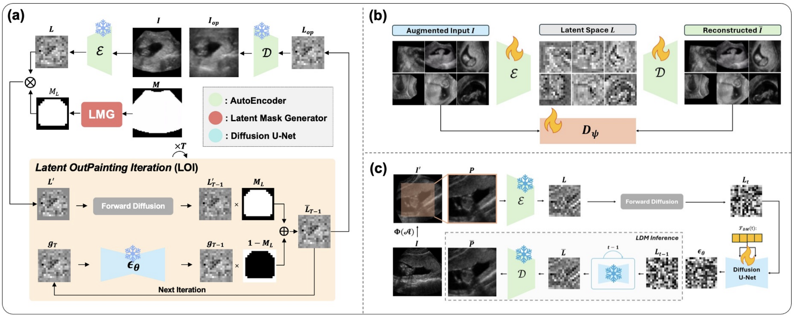
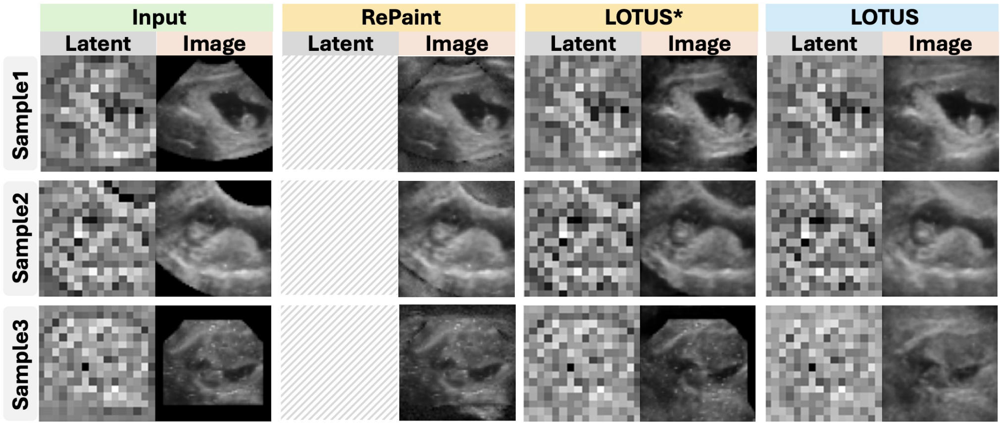
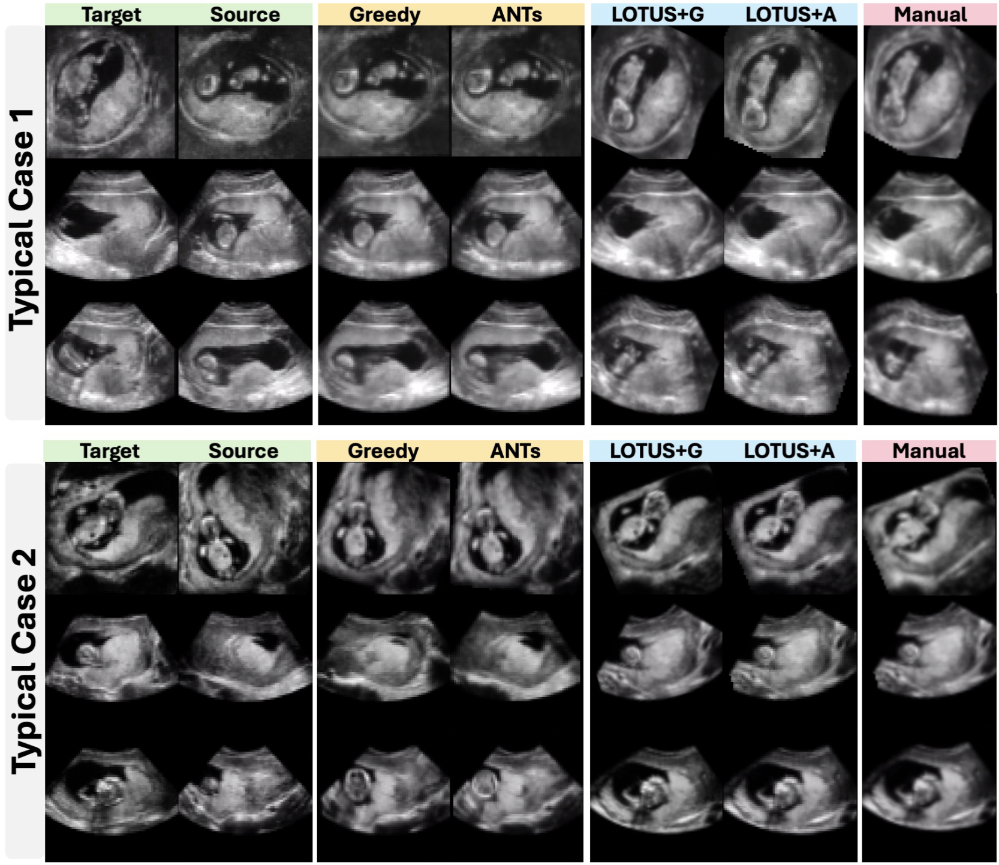
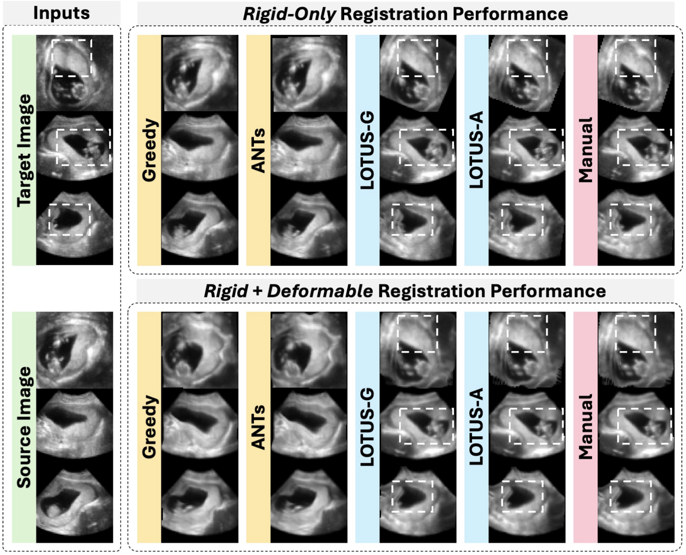

# Please go to [MedICL Lab repo](<https://github.com/MedICL-VU/LOTUS>) for more details!
# [MIDL 2025 Spotlight] LOTUS: Latent Outpainting Diffusion Model for Three-Dimensional Ultrasound Stitching
[](https://openreview.net/forum?id=EyaeQLYCZP)

**LOTUS** is a self-supervised 3D latent diffusion–based outpainting framework, enabling 3D outpainting without paired training data, overcoming the sector-shaped field-of-view limitation inherited from US imaging.



For **outpainting**, **LOTUS** enabled inference-time 3D completion on large missing regions, reduced inference time from 40min to 59s per batch and memory from 759MB to 21MB compared to SOTA methods such as **RePaint3D**.



For **registration**, **LOTUS** mitigated the local minima introduced by FOV effect and significantly (p<0.05) improved registration accuracy by 80%.




## Installation

This project is built on top of [MONAI (Medical Open Network for AI)](<https://github.com/Project-MONAI/GenerativeModels>), with additional usage of MONAI Generative modules for diffusion models.

### Core Dependencies

- Python 3.9+ (recommended)
- PyTorch (CUDA-enabled for 3D training/inference)
- MONAI
- MONAI Generative (`generative` modules, used by LDM/DDPM pipelines)
- Jupyter Notebook (for evaluation/inference notebooks)

### Install Steps

```bash
# 1) Create environment
python -m venv .venv
source .venv/bin/activate

# 2) Install PyTorch first (pick the CUDA/CPU build for your machine)
# See: https://pytorch.org/get-started/locally/

# 3) Install MONAI + MONAI Generative
pip install monai monai-generative

# 4) Install common utilities used in this repo
pip install matplotlib tqdm natsort jupyter nibabel numpy
```

### Suggested Dependency Audit

Before reproducing experiments on a new machine, scan imports across all scripts/notebooks and freeze them into a pinned `requirements.txt`:

```bash
pip freeze > requirements.txt
```

If you want a cleaner minimal list, manually keep only packages actually used in this repository (for example: `torch`, `monai`, `monai-generative`, `matplotlib`, `tqdm`, `natsort`, `numpy`, `jupyter`, `nibabel`).

## Registration

The registration part of this pipeline relies on **well-established intensity-based registration** (similarity metrics, multi-resolution optimization, etc.) rather than a neural registration module shipped in this repository.



- **Primary tools**: We mainly interface with conventional frameworks such as **[ANTs](<https://github.com/antsx/ants>)** and **[Greedy](<https://greedy.readthedocs.io/en/latest/>)** for rigid/affine/deformable alignment and related preprocessing.
- **Installation**: Install and update these tools by following their **official** build and usage instructions (system packages, conda, or prebuilt binaries as appropriate for your platform). We **do not** re-implement ANTs, Greedy, or their optimizers. 

## Code Structure Understanding

The repository can be grouped into four functional modules:

- **LOTUS training**
  - `autoenc_aug_training.py`: 3D autoencoder (with augmentation + adversarial/perceptual objectives).
  - `3D_ldm_training.py`: latent diffusion training using pretrained autoencoder latents.
- **LOTUS evaluation/inference**
  - `lotus_outpaint_evaluation.ipynb`: outpainting/evaluation workflow based on pretrained autoencoder + LDM UNet.
- **RePaint3D training/inference**
  - `3D_ddpm_placenta_training.py`: 3D DDPM training in image space.
  - `RePaint3D_inference.ipynb`: RePaint-style iterative refinement inference.
- **Utilities/transforms**
  - `mytransforms.py`: custom MONAI transforms/cropping-mask helpers.
  - `utiles.py`: file listing helpers (`.nii.gz`, `.png`) and path loading.

### Dependency Flow Across Modules

1. `autoenc_aug_training.py` trains a 3D `AutoencoderKL`.
2. `3D_ldm_training.py` consumes pretrained autoencoder weights and trains latent diffusion UNet.
3. `lotus_outpaint_evaluation.ipynb` consumes both pretrained autoencoder + LDM for outpainting and result inspection.
4. `3D_ddpm_placenta_training.py` and `RePaint3D_inference.ipynb` form an independent DDPM/RePaint3D branch (no latent autoencoder required).

## Getting Started

### Main Components

#### 1) LOTUS (Training / Inference)

Files:
- `autoenc_aug_training.py`
- `3D_ldm_training.py`
- `lotus_outpaint_evaluation.ipynb`

What each stage does:
- **Autoencoder + augmentation training**: learns compact 3D latent representation from NIfTI volumes with spatial augmentation.
- **LDM training**: trains latent-space diffusion UNet using encoded latents from the pretrained autoencoder.
- **Outpainting evaluation**: loads pretrained checkpoints and runs masked generation/outpainting for qualitative and quantitative checks.

#### 2) RePaint3D

Files:
- `3D_ddpm_placenta_training.py`
- `RePaint3D_inference.ipynb`

What each stage does:
- **3D DDPM training**: trains diffusion directly in 3D image space.
- **RePaint iterative refinement**: repeatedly denoise/refine masked regions to complete missing anatomy context.
- **Inference workflow**: load trained DDPM checkpoint, configure scheduler/timesteps, run sampling, and save reconstructions.


#### 3) Registration

Registration uses external intensity-based tools (e.g. ANTs, Greedy); see [Registration](#registration) for installation, scope, and integration expectations.

## Suggested Workflow

Recommended end-to-end pipeline:

1. **Train autoencoder** (LOTUS branch, if you do not already have pretrained weights).
2. **Train generative model**:
   - LOTUS: train latent diffusion (`3D_ldm_training.py`)
   - RePaint3D: train DDPM (`3D_ddpm_placenta_training.py`)
3. **Run inference / outpainting**:
   - LOTUS: `lotus_outpaint_evaluation.ipynb`
   - RePaint3D: `RePaint3D_inference.ipynb`
4. **Evaluate results** with saved visualizations and any dataset-specific metrics.

## Input Dataset Organization

From current data-loading logic, scripts expect NIfTI files (`.nii.gz`) discovered recursively from target folders.

### Expected Structure

- LOTUS and RePaint3D training scripts:
  - `/data/<dataname>/train/**/*.nii.gz`
  - `/data/<dataname>/val/**/*.nii.gz`
- Notebook-based inference/evaluation:
  - typically points to one directory and recursively reads all `.nii.gz` inside.

### Naming and Format Recommendations

- File format: 3D NIfTI (`.nii.gz`)
- Consistent modality/channel ordering across cases
- Keep train/val split deterministic in folder structure
- Use stable case IDs in filenames (e.g., `case_001.nii.gz`)

### Preprocessing Assumptions in Code

- Volumes are loaded as multi-channel then a single channel is selected (`channel = 0` by default).
- Orientation is normalized to `LPI`.
- Spatial crop/affine transforms are applied; many scripts train on `64x64x64` patches.
- Intensity normalization is partially dataset-dependent (some transforms are commented and may need enabling).

### Example Directory Tree

```text
data/
  your_data_name/
    train/
      case_001.nii.gz
      case_002.nii.gz
      ...
    val/
      case_101.nii.gz
      case_102.nii.gz
      ...
```

## Running the Code

> Update hardcoded paths (`dataname`, `input_data_dir`, checkpoint paths, output folders) inside scripts/notebooks before execution.

### Train LOTUS Autoencoder

```bash
python autoenc_aug_training.py
```

### Train LOTUS LDM

```bash
python 3D_ldm_training.py
```

### Run LOTUS Outpainting Evaluation

```bash
jupyter notebook lotus_outpaint_evaluation.ipynb
```

### Train RePaint3D (DDPM)

```bash
python 3D_ddpm_placenta_training.py
```

### Run RePaint3D Inference

```bash
jupyter notebook RePaint3D_inference.ipynb
```

## Notes

- This is a research-oriented codebase; reproducibility depends on careful environment and data alignment.
- Several paths/hyperparameters are intentionally script-level variables and need dataset-specific adjustment.
- Always inspect configuration blocks in each script/notebook (crop size, spacing, channel selection, scheduler steps, checkpoint paths) before running.
- Training is GPU-intensive for 3D volumes; tune patch size and batch size based on available VRAM.

## Citation

If you use our ideas/code in your research, please use the following BibTeX entry.

```
@inproceedings{yao2025lotus,
  title={LOTUS: Latent Outpainting Diffusion Model for Three-Dimensional Ultrasound Stitching},
  author={Yao, Xing and Yu, Runxuan and DiSanto, Nick and Aghdam, Ehsan Khodapanah and Oguine, Kanyifeechukwu Jane and Lu, Daiwei and Lou, Ange and Wang, Jiacheng and Hu, Dewei and Arenas, Gabriel A and others},
  booktitle={Medical Imaging with Deep Learning},
  year={2025}
}
```
